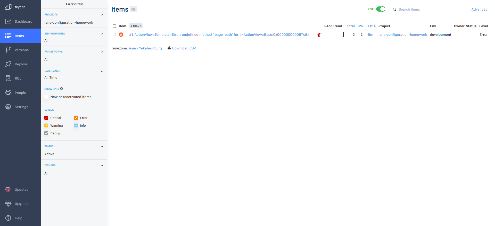

# Конфигурация

## Ссылки

* [Rollbar.com](https://rollbar.com/)
* [Документация Rollbar для настройки в Rails](https://docs.rollbar.com/docs/rails)
* [Что такое трекинг ошибок?](https://guides.hexlet.io/ru/error-tracking/)

## Задачи

Установите и настройке Rollbar следуя [инструкции](https://docs.rollbar.com/docs/rails)

* Зарегистрируйтесь в [Rollbar](https://rollbar.com/) и создайте новый проект

### Gemfile

* Добавьте в *Gemfile* гем - `gem 'rollbar'` и установите его
* Сгенерируйте конфигурацию командой

    ```bash
    bin/rails generate rollbar
    ```

### config/environment.rb

* В *config/environment.rb* добавьте перехват ошибок Rollbar

    ```ruby
    require_relative 'rollbar'

    notify = lambda do |e|
      Rollbar.with_config(use_async: false) do
        Rollbar.error(e)
      end
    rescue StandardError
      Rails.logger.error 'Synchronous Rollbar notification failed.  Sending async to preserve info'
      Rollbar.error(e)
    end

    begin
      Rails.application.initialize!
    rescue Exception => e
      notify.call(e)
      raise
    end
    ```

* Экспортируйте переменную с токеном Rollbar

    ```bash
    export ROLLBAR_ACCESS_TOKEN=<ваш токен>
    ```

* Запустите приложение. При попытке открытия главной страницы будет вызываться ошибка. Если Rollbar настроен корректно, то на сайте появится сообщение.

* Когда будете отправлять домашнее задание на проверку, приложите скриншот ошибки в Rollbar. Пример:


